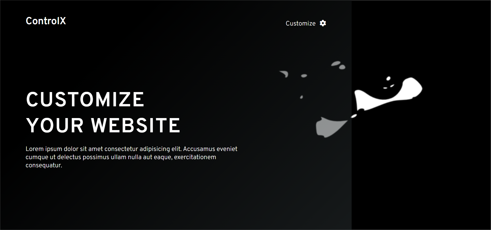

# ControlX | Use CSS Variables With JavaSCript

## Welcome! 👋

Hello! Thanks for cheking out this repository.

## What is it about

It is a customizealbe website that can be customized with the help of CSS variables and vanilla JS.

I've been practicing basic javascript project from [wesbos's javascript 30 course](https://courses.wesbos.com/account/access/62adf09d8ed3995269d75c5a). This is the day3 project.

This project teaches(especially) you how to:

-connect css variables to javascript

-work with data-* atribute

-call function with change and mouseover eventlistener

Here is my project site's url-
<drougnov.github.io/controlX/>

## Built with

-HTML

-CSS

-Javascript

## Author

Facebook -[Biplob Barua Rocky] <https://www.facebook.com/drougnov.bd.9>

Frontend Mentor - <https://www.facebook.com/ANT1D0t35>

### Any suggestion

I would be glad and greatful if you could leave any suggestion for this project or about anything else. Have a good day :)
